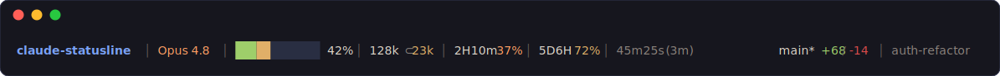
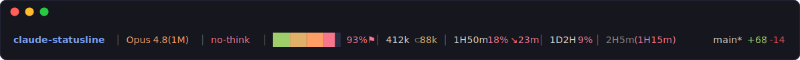
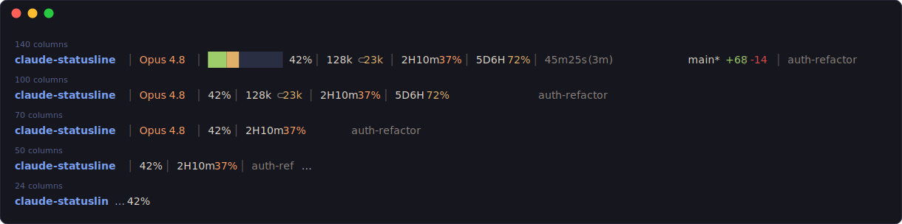
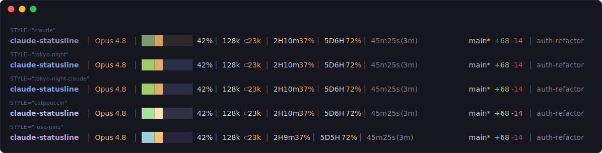

# claude-statusline

A one-line statusline for [Claude Code](https://claude.ai/code) that warns you *before* you
hit your rate limit — not after.

**macOS · stock bash 3.2 · `jq` is the only dependency · ~26 ms a frame**



Calm by default — warnings appear only when the condition is real, so when the line shouts,
believe it. Every glyph is decoded in [Reading the line](#reading-the-line):



## Install

```bash
brew install jq   # once, if you don't already have it
git clone https://github.com/wieTW/claude-statusline.git
cd claude-statusline
./install.sh
```

Restart your Claude Code session — the line appears at the bottom.

- Clone to somewhere **permanent**: the installer wires this folder's absolute path into
  your settings, so moving or deleting the folder later kills the line.
- `install.sh` **merges** into `~/.claude/settings.json`: your permissions, hooks and model
  are left alone, the file is **backed up** first, and it's safe to re-run any time.
- The first frame can look sparse — the token count and the quota trend warm up over the
  next few renders. That's normal, not a broken install.
- macOS only as shipped (BSD `stat`/`date`; runs on the stock bash 3.2 — nothing to upgrade).

<details>
<summary><b>Install options</b> — refresh interval, manual wiring, optional dependencies</summary>

```bash
./install.sh 30                 # refresh every 30s instead of the default 60
REFRESH_INTERVAL=0 ./install.sh # no refresh timer (update only on activity)
```

The default `"refreshInterval": 60` re-renders the line every 60 seconds even while you're
idle — without it the countdowns freeze and the cache-freshness color stops updating the
moment you step away. The burn alarm samples your quota once per render and needs samples
spread over minutes to measure a slope, so ~30s is the lowest interval you'd want; below
~15s the sampling series degrades and the alarm can go quiet.

Prefer to wire it up by hand? Add this to `~/.claude/settings.json` (absolute path — the
script still needs `jq` at runtime; you're only skipping the installer's check for it):

```json
{
  "statusLine": {
    "type": "command",
    "command": "/absolute/path/to/claude-statusline/statusline-command.sh",
    "refreshInterval": 60
  }
}
```

Optional tools, each degrading gracefully if missing: **`git`** (no git segment),
**`perl`** (pure-bash wide-char truncation fallback), **`stty`** (simpler layout).
</details>

## Reading the line

| Segment | Example | What it tells you |
|---------|---------|-------------------|
| **Path** | `claude-statusline` | The project / sub-path you're in |
| **Model** | `Opus 4.8` | Active model; a 1M-context variant shows `(1M)` |
| **Thinking** | `no-think` | Only when abnormal: red `no-think` = extended thinking is off |
| **Context** | `█████░░░░░░░ 42%` | How full the window is before Claude Code compacts the conversation; red only near the limit. `⚑` = crossed 200k tokens, where cost rises and caching changes |
| **Tokens** | `128k ⊂23k` | Session input+output, subagents after `⊂`; cache tokens excluded |
| **5h quota** | `2H10m 37%` | Resets in 2h10m, 37% left; `↘23m` = projected to run dry *before* the reset |
| **7d quota** | `5D6H 72%` | The same, for the weekly limit |
| **Time** | `45m25s (3m)` | Time Claude spent producing responses (idle and local tool runs excluded); `(3m)` = time since your last prompt — its color says whether the prompt cache is still warm (see below) |
| **Git** | `main* +68/-14` | Branch, `*` if dirty, diffstat — pinned to the right edge |
| **Name** | `auth-refactor` | Worktree / session name, when set (sessions: `/rename`) |

## Why this one

- **Burn alarm `↘23m`** — extrapolates how fast your 5h quota is burning; fires *only* when
  you're on track to run dry before the reset. Flat or falling usage shows nothing.
- **No stale quota lies** — Claude Code freezes each session's rate-limit % at startup, so
  older terminals show wrong numbers; this syncs the true % across all your open sessions.
- **Cache-freshness delta `(3m)`** — time since your last prompt, colored by Anthropic's two
  real prompt-cache TTLs: dim = warm, yellow past ~5 min, red past ~1 h (next prompt pays a
  full cache re-write).
- **A token count you can trust** — cache tokens excluded (stable across cache churn),
  transcript rows deduped (naive summing over-counts ~10x), summed in the background so
  rendering never waits.
- **Budget-aware context red-line** — 80% on 200k-class models but 92% on 1M models, so a
  half-empty 1M window is never falsely flagged.
- **~26 ms a frame** — every slow lookup (jq, git ×3, theme, width) runs concurrently.
- **Never wraps** — segments shrink, then drop, in a fixed 14-step order; path and context %
  survive down to a 2-column terminal:



## Configure

Five themes, picked with `STYLE` at the top of `statusline-command.sh`:



| Setting | Default | What it does |
|---------|---------|-------------|
| `STYLE` | `tokyo-night-claude` | `claude` / `tokyo-night` / `tokyo-night-claude` / `catppuccin` / `rose-pine` |
| `CTX_BAR` | `true` | Gradient context bar; `false` for plain `ctx:42%` text |
| `NORM_THINKING` | `true` | Thinking is the norm — warn (red `no-think`) only when it's off |
| `RIGHT_ALIGN` | `true` | Pin the git/session half to the terminal's right edge |
| `RL_SYNC` | `true` | Cross-session rate-limit sync; off = each session keeps its frozen startup snapshot |
| `BURN_SENS` | `balanced` | Burn-alarm eagerness: `conservative` / `balanced` / `sensitive` |
| `LASTMSG_WARN` / `LASTMSG_STALE` | `300` / `3600` | Idle seconds before the `(Δ)` turns yellow / red — matched to the 5-min / 1-h cache TTLs |

## Contributing

Every screenshot above is real output — `bash assets/generate.sh` re-renders them through
the actual script, so if they look wrong, something *is* wrong.

```bash
# Render one frame by hand — the fastest dev loop (COLUMNS sets the width)
printf '{"workspace":{"current_dir":"%s"},"model":{"display_name":"Opus 4.8 (1M context)"},"context_window":{"used_percentage":42}}' "$PWD" \
  | COLUMNS=140 bash statusline-command.sh

# Full check before committing
bash -n statusline-command.sh && bash -n lib/collect.sh && bash -n lib/render.sh   # syntax
shellcheck -x statusline-command.sh                                               # lint
bash tests/run-tests.sh                                                           # suite → "ALL CHECKS PASSED"
```

Architecture, the concurrency model, and the hard rules (bash 3.2 only, never `set -e`,
input sanitization) live in [`CLAUDE.md`](CLAUDE.md).
