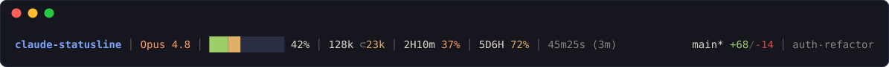
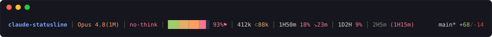
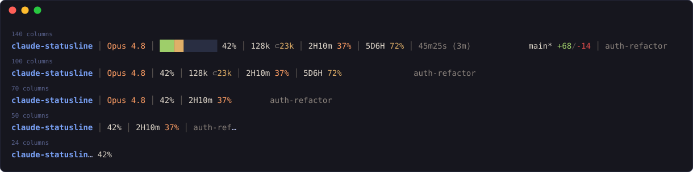
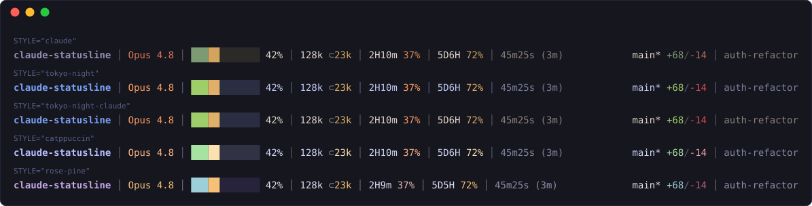

<h1 align="center">claude-statusline</h1>

<p align="center"><b>Idle Claude Code sessions keep their last quota&nbsp;%. This line shares the freshest —
and warns <code>↘21m</code> before you run dry.</b></p>

<p align="center">One colored line for <a href="https://claude.ai/code">Claude Code</a> ·
macOS · stock bash 3.2 · <code>jq</code> is the only dependency · ~26&nbsp;ms a frame</p>

<p align="center">
  
  
  
  
</p>

<p align="center"></p>

That loop is one afternoon, re-rendered live: the quota countdown falls, the burn alarm `↘`
appears the moment the projection says you'll run dry *before* the reset — yellow first,
then red. Calm by default; when the line shouts, believe it. Every glyph is decoded in
[Reading the line](#reading-the-line).

## Install

```bash
brew install jq   # once, if you don't already have it
git clone https://github.com/wieTW/claude-statusline.git
cd claude-statusline
./install.sh
```

Restart your Claude Code session — the line appears at the bottom.

- Clone to somewhere **permanent**: the installer wires this folder's absolute path into
  your settings, so moving or deleting the folder later kills the line.
- `install.sh` **merges** into `~/.claude/settings.json`: your permissions, hooks and model
  are left alone, the file is **backed up** first, and it's safe to re-run any time.
- The first frame can look sparse — the token count and the quota trend warm up over the
  next few renders. That's normal, not a broken install.
- macOS only as shipped (BSD `stat`/`date`; runs on the stock bash 3.2 — nothing to upgrade).

<details>
<summary><b>Install options</b> — refresh interval, manual wiring, optional dependencies</summary>

```bash
./install.sh 30                 # refresh every 30s instead of the default 60
REFRESH_INTERVAL=0 ./install.sh # no refresh timer (update only on activity)
```

The default `"refreshInterval": 60` re-renders the line every 60 seconds even while you're
idle — without it the countdowns freeze and the cache-freshness color stops updating the
moment you step away. The burn alarm samples your quota once per render and needs samples
spread over minutes to measure a slope, so ~30s is the lowest interval you'd want; below
~15s the sampling series degrades and the alarm can go quiet.

Prefer to wire it up by hand? Add this to `~/.claude/settings.json` (absolute path — the
script still needs `jq` at runtime; you're only skipping the installer's check for it):

```json
{
  "statusLine": {
    "type": "command",
    "command": "/absolute/path/to/claude-statusline/statusline-command.sh",
    "refreshInterval": 60
  }
}
```

Optional tools, each degrading gracefully if missing: **`git`** (no git segment),
**`perl`** (pure-bash wide-char truncation fallback), **`stty`** (simpler layout).
</details>

## Reading the line

A healthy frame — every example in the table below is taken from it, character for character:



| Segment | Example | What it tells you |
|---------|---------|-------------------|
| **Path** | `claude-statusline` | The project / sub-path you're in. Cmd+click opens that folder in Finder, once the iTerm2 rule below is set up |
| **Model** | `Opus 4.8` | Active model; `(1M)` appears when the session's context window is 1M |
| **Thinking** | `no-think` | Only when abnormal: red `no-think` = extended thinking is off |
| **Context** | `█████░░░░░░░ 42%` | How full the window is, on the same basis as Claude Code's own `Context low (N% remaining)` warning, so the two always add up to 100; red only near the limit. `⚑` = crossed 200k tokens, where cost rises and caching changes |
| **Tokens** | `128k ⊂23k` | Session input+output, subagents after `⊂`; cache tokens excluded |
| **5h quota** | `2H10m 37%` | Resets in 2h10m, 37% left; `↘23m` = projected to run dry *before* the reset |
| **7d quota** | `5D6H 72%` | The same, for the weekly limit |
| **Time** | `45m25s (3m)` | Time Claude spent producing responses (idle and local tool runs excluded); `(3m)` = time since your last prompt — its color says whether the prompt cache is still warm (see below) |
| **Git** | `main* +68/-14` | Branch, `*` if dirty, diffstat — pinned to the right edge |
| **Name** | `auth-refactor` | Worktree / session name, when set (sessions: `/rename`) |

### How the context % is computed

Claude Code's `used_percentage` field and its own `Context low (N% remaining)` warning do **not** agree: the warning
counts output tokens too, and it leaves an output reserve out of the window. Near a full window the two readings drift
about 2 points apart, which is exactly when you need the number to be right. So the statusline recomputes the warning's
figure locally and shows its complement:

```
T = current_usage.input_tokens + cache_creation_input_tokens + cache_read_input_tokens + output_tokens
P = context_window_size - 20000            # 20000 = the output reserve Claude Code keeps back
R = round(100 * (P - T) / P)               # what "Context low (R% remaining)" shows; (P - T) never goes below 0
displayed % = 100 - R
```

Worked example, a 1M window at `T = 960400`: `P = 980000`, `R = round(100 * 19600 / 980000) = 2`, so the line shows
`98%` while Claude Code warns `Context low (2% remaining)`. The old behaviour showed `96%` for that same frame.

A frame that carries no `current_usage` block (older Claude Code builds) falls back to the upstream `used_percentage`
unchanged, so nothing regresses.

**If the number looks wrong:** the reserve was verified against **Claude Code 2.1.232** (2026-08-14) and a future build
may change it. It is the single `CTX_RESERVE` constant at the top of `statusline-command.sh`, with the re-verification
method in its comment. One known gap: with auto-compact **on**, Claude Code's `N% until auto-compact` indicator holds
back a further 13000 tokens, so against that particular indicator this reading stays slightly optimistic. It is aligned
to the `Context low` warning, which is the auto-compact-off basis.

## Why this one

- **Burn alarm `↘23m`** — extrapolates how fast your 5h quota is burning; fires *only* when
  you're on track to run dry before the reset. Flat or falling usage shows nothing.
- **No stale quota lies** — Claude Code refreshes rate limits after API round trips, while
  idle terminals retain their last value; this syncs the freshest observation across sessions.
- **Cache-freshness delta `(3m)`** — time since your last prompt, colored by Anthropic's two
  real prompt-cache TTLs: dim = warm, yellow past ~5 min, red past ~1 h (next prompt pays a
  full cache re-write).

And when several things go wrong at once — a 1M-context session past the `⚑` 200k cliff,
thinking off, quota burning, cache cold — the line looks like this and nothing on it is
decoration:


- **A token count you can trust** — cache tokens excluded (stable across cache churn),
  transcript rows deduped (naive summing over-counts ~10x), summed in the background so
  rendering never waits.
- **Budget-aware context red-line** — 80% on 200k-class models but 92% on 1M models, so a
  half-empty 1M window is never falsely flagged.
- **~26 ms a frame** — every slow lookup (jq, git ×3, theme, width) runs concurrently.
- **Never wraps** — segments shrink, then drop, in a fixed 14-step order; path and context %
  survive down to a 2-column terminal:



## Configure

Five themes, picked with `STYLE` at the top of `statusline-command.sh`:



| Setting | Default | What it does |
|---------|---------|-------------|
| `STYLE` | `tokyo-night-claude` | `claude` / `tokyo-night` / `tokyo-night-claude` / `catppuccin` / `rose-pine` |
| `CTX_BAR` | `true` | Gradient context bar; `false` for plain `ctx:42%` text |
| `NORM_THINKING` | `true` | Thinking is the norm — warn (red `no-think`) only when it's off |
| `PATH_CLICK` | `true` | Publish this pane's directory so cmd+click on the path can open it (see below); `false` publishes nothing |
| `RIGHT_ALIGN` | `true` | Pin the git/session half to the terminal's right edge |
| `RL_SYNC` | `true` | Cross-session rate-limit sync; off = each session keeps its own last reported observation |
| `BURN_SENS` | `balanced` | Burn-alarm eagerness: `conservative` / `balanced` / `sensitive` |
| `LASTMSG_WARN` / `LASTMSG_STALE` | `300` / `3600` | Idle seconds before the `(Δ)` turns yellow / red — matched to the 5-min / 1-h cache TTLs |

### Clickable path

Cmd+click the path segment and that folder opens in Finder, while the segment keeps showing the short name.

It takes one setup step, because the statusline itself cannot carry a hyperlink: Claude Code re-renders the line through
its own style model and drops OSC 8 escapes, so the terminal has to do the opening. The statusline publishes this pane's
directory to `~/.claude/sl-cwd/<claude pid>`; a small script turns the pane's tty back into that directory.

In iTerm2: **Settings > Profiles > _your profile_ > Advanced > Smart Selection > Edit > `+`**

1. **Regular Expression** — matches the statusline's first segment, and nothing in ordinary prose:

   ```
   (?<![\w·])(?<!· )[A-Za-z0-9._@][A-Za-z0-9._@/-]*(?= ·)
   ```

2. Select that row, open its **Actions**, add one, set it to **Run Command…**, tick **Use interpolated strings for
   parameters**, and give it the script plus the pane's tty:

   ```
   /path/to/claude-statusline/scripts/open-pane-dir.sh \(session.tty)
   ```

   Without interpolated strings, pass no argument: the script then asks iTerm2 for the frontmost session, which is the
   pane you just clicked.

A cmd+click on text matching a smart selection rule runs that rule's first action. Claude Code having mouse reporting on
does not interfere: iTerm2 keeps cmd+click for itself.

If nothing opens, check `ls ~/.claude/sl-cwd/` — it should hold one file per open pane, named by that pane's claude pid.

### Subagent rows

Claude Code lists the subagents it is currently running, one row each, and by default a row shows only the
current activity. Run three at once and you cannot tell which one is on the expensive model, whose context
window got cut to 200K, or which one is burning your quota. `subagent-status-line.sh` takes those rows over:

```
實作 subagent 狀態列 │ Opus 5(1M) │ 262k │ Updating sa3b expectation in run-tests.sh
Remove library-divergence-watch │ Sonnet 5(200K) │ 43k │ Reading threshold-watch.sh
Codex: review relay guard design │ Sonnet 5(1M)
no window size reported │ Haiku 4.5 │ 1.2M │ bracket omitted, 7-digit tokens
```

Task description, the model with its context window, the tokens it has burned, then what it is doing.

The window marker is the point of the second segment: `(1M)` sits in the model's own colour because that is
normal, while anything smaller turns warning-yellow — a shrunken window is the thing you want to notice. Token
usage is deliberately *not* yellow: yellow already means "window cut down" here, and the main status line uses
it for its own subagent-token total, so a second yellow would make the actual warning unreadable.

Nothing is ever guessed. No window reported means no bracket at all, no token count means no token segment, and
the model display name is derived from the model id by rule, so a model this script has never heard of shows its
real id rather than some older model's name. The third row above shows two of those omissions at once: Claude
Code fills `label` with the description while an agent is starting, so a row that would print the same sentence
twice prints it once, and a subagent that has burned nothing yet reports nothing rather than `0`.

It is a second entry point, wired up separately and **not** touched by `install.sh` — add it to
`~/.claude/settings.json` yourself:

```json
{
  "subagentStatusLine": {
    "type": "command",
    "command": "/path/to/claude-statusline/subagent-status-line.sh"
  }
}
```

That setting takes only those two fields; there is no refresh interval or padding to set. If a row is missing the
information this line exists to show, the script simply says nothing about that row and Claude Code keeps its own
default display for it — so the worst case is what you have today, never a wrong model name. When the terminal is
narrow the activity label is shortened first and the description second; the model and token segments are never
truncated, because they are what the row was added to carry. One thing it cannot show: the subagent's *agent
type*. It is not in the payload Claude Code sends.

---

*If the `↘` ever fires with enough time left to land your commit, a ⭐ helps the next person
see theirs coming.*

## Contributing

Every screenshot above is real output — `bash assets/generate.sh` re-renders them through
the actual script, so if they look wrong, something *is* wrong.

```bash
# Render one frame by hand — the fastest dev loop (COLUMNS sets the width)
printf '{"workspace":{"current_dir":"%s"},"model":{"display_name":"Opus 4.8 (1M context)"},"context_window":{"used_percentage":42}}' "$PWD" \
  | COLUMNS=140 bash statusline-command.sh

# Full check before committing
bash -n statusline-command.sh && bash -n lib/collect.sh && bash -n lib/render.sh   # syntax
shellcheck -x statusline-command.sh                                               # lint
bash tests/run-tests.sh                                                           # suite → "ALL CHECKS PASSED"
```

### Is a test actually testing anything?

A green suite is not evidence that a rule is guarded. `scripts/mutation-check.sh` answers that
directly: it breaks one thing on purpose, runs the suite, says whether the suite noticed, then puts
the file back and proves the restore with `cmp`.

```bash
# Is the "no model -> keep Claude Code's default row" guard actually tested?
scripts/mutation-check.sh subagent-status-line.sh \
  '[ -n "$sa_id" ] && [ -n "$sa_model" ] || continue' '[ -n "$sa_id" ] || continue'
# GUARDED — the suite went red (rc=1). Source restored.
```

`GAP` instead means nothing tests that rule. Both times it happened here the tests *looked* complete.
One fixture was missing three fields at once, so the first guard was never reached and deleting it
changed nothing. Another assertion was negative-only ("this id must not appear"), which a completely
blank output satisfies just as well as a working guard.

So run the three blanket mutations first — emit nothing, blank every `content`, blank every `id`.
Any assertion they fail to turn red is a negative-only assertion, and it needs a positive control row
beside it: a complete row that MUST be emitted, checked by its rendered text rather than by its id.

Architecture, the concurrency model, and the hard rules (bash 3.2 only, never `set -e`,
input sanitization) live in [`CLAUDE.md`](CLAUDE.md).
